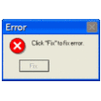

## Intro
<h1 align="center">Hi , I'm Hiranmayee</h1>
<h3 align="center">Fueled by creativity and curiosity 🤹‍♂️, Always ready to learn, debug, and occasionally cry over code - but in a fun way!</h3>

## About Me
-  Talk to me in **Python**
-  How to reach me **hisree.p2k4@gmail.com**
- 📄 Know about me [Resume](https://drive.google.com/file/d/1Q8Qy3N1j6IuGPHZUJ5Xy8JKZkelEDurW/view?usp=sharing)
-  Debugging level **Expert at creating more bugs than I fix!**
- ⚡ Hidden Feature **Balancing between "it works!" and "why does it work?"**

## Profile Views

## Connect With Me
<h3 align="left">Connect with me:</h3>

  

## Languages and Tools
<h3 align="left">Languages and Tools:</h3>

  
   
   
  
   
   
   
   
   

## Stats

  <!--  -->
  

